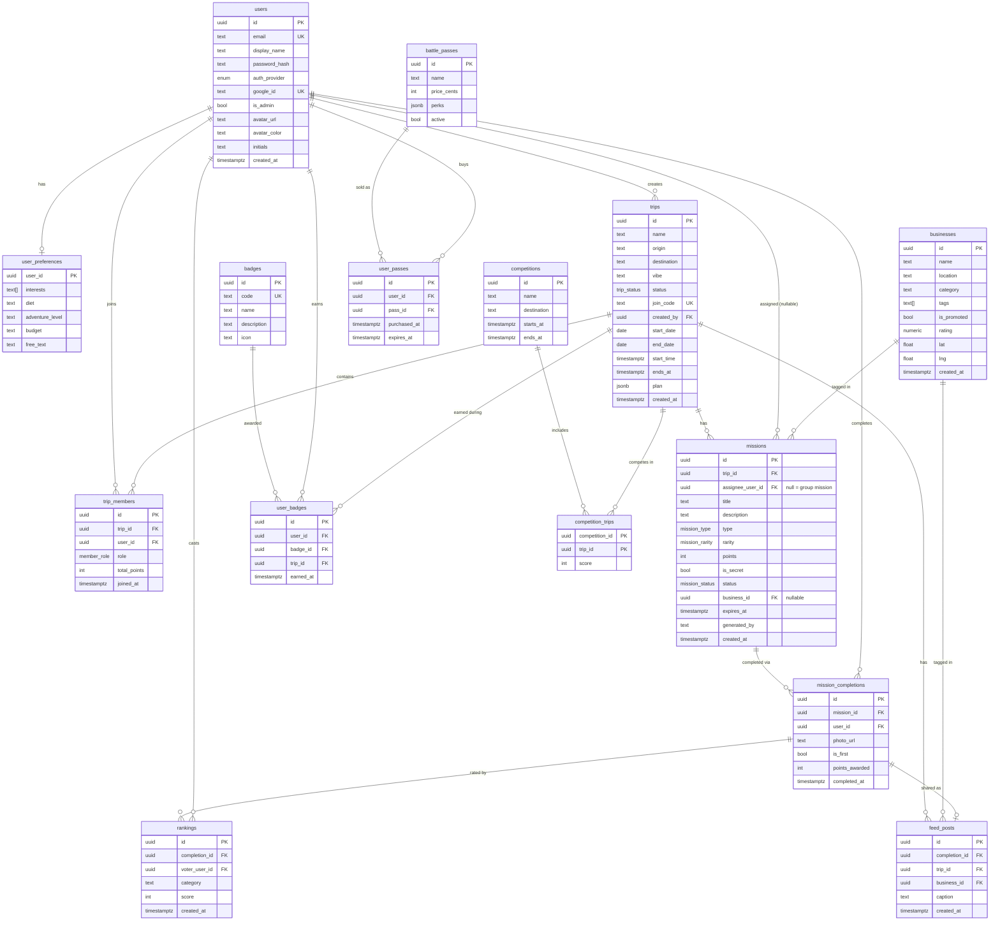

# SideQuest — Database Architecture & Schema

> **Purpose:** The single reference for our database design. It supports the
> **entire project** (MVP + later features) so we can build the backend DB
> structure once, seamlessly. Pairs with [`BACKEND.md`](BACKEND.md) (contracts)
> and [`backend/app/store.py`](backend/app/store.py) (the in-memory dev mirror
> to be swapped for these tables).
>
> **Default engine:** Supabase (PostgreSQL). The design is standard SQL, so it
> ports to any Postgres. Diagram renders on GitHub (Mermaid).

---

## 1. Design principles

- **Build MVP tables first**, but model the whole thing so later features
  (strangers joining, travel feed, battle passes, group-vs-group) need no rewrite.
- **UUID primary keys** everywhere (`gen_random_uuid()`), created via `pgcrypto`.
- **Every child references its parent** with `ON DELETE CASCADE` where a child
  can't exist without the parent (e.g. missions without a trip).
- **Enums as Postgres types** for status/type/rarity → integrity + clarity.
- **`created_at`** timestamps on core tables (add `updated_at` later only where
  mutation history matters — omitted for MVP simplicity).
- **Row Level Security (RLS)** notes included; for the 24h demo we can run with
  the service-role key on the backend and enable strict RLS later.

**Legend:** 🟢 MVP (build now) · 🔵 Later (schema ready, not built for demo) ·
🟣 Roadmap (future monetization / competition — sketched for completeness)

---

## 2. Entity-Relationship Diagram



---

## 3. Tables at a glance

| Table | Tier | Purpose |
|---|---|---|
| `users` | 🟢 | Accounts: anonymous, email+password (incl. admin override), Google (in dev). Holds avatar color/initials. |
| `user_preferences` | 🟢 | Feeds the AI mission engine. |
| `trips` | 🟢 | A group + game instance (one per trip). Has a `join_code`. |
| `trip_members` | 🟢 | Who's in a trip + their running score. |
| `missions` | 🟢 | AI/fallback-generated missions (solo/group/secret). |
| `mission_completions` | 🟢 | A player completing a mission (photo optional, first-to-finish flag). |
| `rankings` | 🔵 | Friends rating each other's completions (best food, funniest…). |
| `badges` / `user_badges` | 🔵 | Badge catalog + the user's passport. |
| `businesses` | 🟢* | Small businesses for exposure + monetization. *Populated at trip start from Gemini Maps grounding (`services/places.py`); missions link via `business_id`.* |
| `feed_posts` | 🔵 | Travel feed sharing checkpoint photos with tagged businesses. |
| `competitions` / `competition_trips` | 🟣 | Group-vs-group "Best Travel Group" across trips to the same destination. |
| `battle_passes` / `user_passes` | 🟣 | Paid passes granting location discounts (monetization). |

---

## 4. Full SQL schema (Postgres / Supabase)

> Run in the Supabase SQL editor. Build the 🟢 MVP section first; the 🔵 section
> is safe to run now too (it just prepares later features).

```sql
-- Extensions
create extension if not exists pgcrypto;

-- ---------- Enums ----------
create type trip_status     as enum ('draft', 'active', 'arrived', 'ended');
create type member_role     as enum ('host', 'player');
create type mission_type    as enum ('solo', 'group', 'secret');
create type mission_rarity  as enum ('common', 'rare', 'legendary');
create type mission_status  as enum ('open', 'completed');
create type auth_provider   as enum ('anonymous', 'email', 'google');

-- ========== 🟢 MVP ==========

create table users (
    id             uuid primary key default gen_random_uuid(),
    email          text unique,                         -- null for anonymous users
    display_name   text not null default 'Player',
    password_hash  text,                                -- null unless email auth (PBKDF2)
    auth_provider  auth_provider not null default 'anonymous',
    google_id      text unique,                         -- set for Google sign-in (in dev)
    is_admin       boolean not null default false,      -- admin override account
    avatar_url     text,
    avatar_color   text,                                -- hex used for stamp/avatar UI
    initials       text,                                -- e.g. "BB" for the avatar
    created_at     timestamptz not null default now()
);
-- Auth model: anonymous (frictionless demo), email+password (incl. the admin
-- override betterbash@gmail.com — see §8 seed), and Google (in development).
-- Real secrets/hashes live server-side only; never returned to the client.

create table user_preferences (
    user_id          uuid primary key references users(id) on delete cascade,
    interests        text[] not null default '{}',
    diet             text,
    adventure_level  text,
    budget           text,
    free_text        text
);

create table trips (
    id           uuid primary key default gen_random_uuid(),
    name         text not null,
    origin       text,
    destination  text,
    vibe         text,
    status       trip_status not null default 'draft',
    join_code    text unique not null,
    created_by   uuid not null references users(id) on delete cascade,
    start_date   date,          -- trip window (shown on the dashboard cards)
    end_date     date,
    start_time   timestamptz,
    ends_at      timestamptz,   -- optional overall trip countdown (design: countdown timer)
    plan         jsonb,         -- rich mission plan (mission_generator.md via the LLM)
    created_at   timestamptz not null default now()
);
create index on trips (join_code);

create table trip_members (
    id            uuid primary key default gen_random_uuid(),
    trip_id       uuid not null references trips(id) on delete cascade,
    user_id       uuid not null references users(id) on delete cascade,
    role          member_role not null default 'player',
    total_points  int not null default 0,
    joined_at     timestamptz not null default now(),
    unique (trip_id, user_id)
);
create index on trip_members (trip_id);

create table missions (
    id                uuid primary key default gen_random_uuid(),
    trip_id           uuid not null references trips(id) on delete cascade,
    assignee_user_id  uuid references users(id) on delete set null, -- null = group
    title             text not null,
    description       text,
    type              mission_type not null default 'solo',
    rarity            mission_rarity not null default 'common',
    points            int not null default 100,
    is_secret         boolean not null default false,
    status            mission_status not null default 'open',
    business_id       uuid,  -- FK added in 🔵 section
    expires_at        timestamptz,  -- optional per-mission timer (nullable = no limit)
    generated_by      text not null default 'ai',
    created_at        timestamptz not null default now()
);
create index on missions (trip_id);
create index on missions (assignee_user_id);

create table mission_completions (
    id              uuid primary key default gen_random_uuid(),
    mission_id      uuid not null references missions(id) on delete cascade,
    user_id         uuid not null references users(id) on delete cascade,
    photo_url       text,
    is_first        boolean not null default false,
    points_awarded  int not null default 0,
    completed_at    timestamptz not null default now(),
    unique (mission_id, user_id)   -- a user completes a mission once
);
create index on mission_completions (mission_id);

-- ========== 🔵 Later (schema-ready) ==========

create table businesses (
    id           uuid primary key default gen_random_uuid(),
    name         text not null,
    location     text,
    category     text,
    tags         text[] not null default '{}',
    is_promoted  boolean not null default false,  -- monetization hook
    rating       numeric,                         -- from the LLM/maps data
    lat          double precision,
    lng          double precision,
    created_at   timestamptz not null default now()
);

alter table missions
    add constraint missions_business_fk
    foreign key (business_id) references businesses(id) on delete set null;

create table rankings (
    id             uuid primary key default gen_random_uuid(),
    completion_id  uuid not null references mission_completions(id) on delete cascade,
    voter_user_id  uuid not null references users(id) on delete cascade,
    category       text not null,          -- best_food | best_photo | funniest | ...
    score          int not null default 1,
    created_at     timestamptz not null default now(),
    unique (completion_id, voter_user_id, category)  -- one vote per category
);

create table badges (
    id           uuid primary key default gen_random_uuid(),
    code         text unique not null,     -- e.g. 'first_mission'
    name         text not null,
    description  text,
    icon         text
);

create table user_badges (
    id         uuid primary key default gen_random_uuid(),
    user_id    uuid not null references users(id) on delete cascade,
    badge_id   uuid not null references badges(id) on delete cascade,
    trip_id    uuid references trips(id) on delete set null,
    earned_at  timestamptz not null default now(),
    unique (user_id, badge_id, trip_id)
);

create table feed_posts (
    id             uuid primary key default gen_random_uuid(),
    completion_id  uuid not null references mission_completions(id) on delete cascade,
    trip_id        uuid not null references trips(id) on delete cascade,
    business_id    uuid references businesses(id) on delete set null,
    caption        text,
    created_at     timestamptz not null default now()
);
create index on feed_posts (trip_id);

-- ========== 🟣 Roadmap (future — sketch, safe to skip for hackathon) ==========

-- Group-vs-group competition ("Best Travel Group", esp. peak season)
create table competitions (
    id           uuid primary key default gen_random_uuid(),
    name         text not null,
    destination  text,
    starts_at    timestamptz,
    ends_at      timestamptz,
    created_at   timestamptz not null default now()
);

create table competition_trips (
    competition_id  uuid not null references competitions(id) on delete cascade,
    trip_id         uuid not null references trips(id) on delete cascade,
    score           int not null default 0,   -- aggregated group score
    primary key (competition_id, trip_id)
);

-- Battle passes (users buy passes → discounts at partner locations)
create table battle_passes (
    id           uuid primary key default gen_random_uuid(),
    name         text not null,
    price_cents  int not null default 0,
    perks        jsonb not null default '{}'::jsonb,
    active       boolean not null default true,
    created_at   timestamptz not null default now()
);

create table user_passes (
    id            uuid primary key default gen_random_uuid(),
    user_id       uuid not null references users(id) on delete cascade,
    pass_id       uuid not null references battle_passes(id) on delete cascade,
    purchased_at  timestamptz not null default now(),
    expires_at    timestamptz,
    unique (user_id, pass_id)
);
```

### Design notes (read these)

- **Group missions** (`assignee_user_id IS NULL`): each member may record their own
  `mission_completion` for a group mission (unique per `(mission_id, user_id)`), so
  everyone who participates gets points. The **first** completer still gets the
  first-to-finish bonus. If you'd rather a group mission be "completed once for the
  whole group," enforce that in the API — the schema supports both readings.
- **Points are denormalized** onto `trip_members.total_points` (fast leaderboard
  reads / polling). They must always equal the sum of that member's
  `mission_completions.points_awarded` for the trip — only mutate via the scoring
  service so they can't drift.
- **Strangers joining a trip** (a "later" feature) needs **no schema change** — it's
  just another `trip_members` row with `role = 'player'` created via a discovery flow.
- **Timed missions:** `missions.expires_at` is nullable — most missions have no
  limit (`NULL`) and never expire; some are timed. The clock starts at trip start
  (when missions are generated). The API rejects completing an expired mission
  (`409`), and the missions list returns a computed `is_expired` flag for the UI.

---

## 5. Storage (Supabase Storage)

Files are NOT stored in the DB — only their paths/URLs are (e.g.
`mission_completions.photo_url`, `feed_posts` images, `users.avatar_url`).

| Bucket | Tier | Contents | Access |
|---|---|---|---|
| `mission-photos` | 🟢 (stretch) | Checkpoint completion photos | Private → signed URLs for trip members |
| `avatars` | 🔵 | Profile images | Public or signed |
| `feed` | 🔵 | Travel-feed images | Signed |

---

## 6. Row Level Security (RLS) — plan

For the **24h demo**, the backend uses the **service-role key** and enforces
access in the API layer (keep it simple, ship fast). For a fair-and-safe
production posture, enable RLS with policies like:

- `users`: a user can read/update only their own row.
- `trips` / `trip_members` / `missions` / `mission_completions`: readable only by
  members of that trip; secret missions readable only by their `assignee_user_id`.
- `rankings`: a member can insert a vote for completions in their trip, once per category.

> Decision logged in `BACKEND.md §12`: RLS strict later; service-role + API checks now.

---

## 7. How this maps to the code

- The in-memory dev store [`backend/app/store.py`](backend/app/store.py) mirrors
  these tables function-for-function. To go live on Supabase, replace each
  function body with the equivalent query — **routers and contracts don't change.**
- Pydantic models in [`backend/app/models.py`](backend/app/models.py) are the API
  shapes; keep column names aligned with them.

---

## 8. Seed data

**Admin override user (required).** While Google sign-in is in development, an admin
account lets the app be used without OAuth. Credentials are **not hardcoded** — the
backend seeds them **from environment variables** into the `users` table on startup:

- Set `ADMIN_EMAIL` / `ADMIN_PASSWORD` in the backend env (`.env`).
- `store._seed()` inserts the row (`auth_provider='email'`, `is_admin=true`,
  password stored **hashed**) if it doesn't already exist. Once seeded, the row
  persists in the DB and login validates against it.
- No plaintext credential lives in source; the values live in `.env` (gitignored)
  and as a hashed row in the database.

**For a lively demo**, also pre-insert a few `businesses` (real SA spots on your
demo route) and a handful of `badges` (`first_mission`, `five_missions`,
`group_complete`, `first_to_finish`) so the passport and business-tagging story
look real on stage.

---

*Last updated: 2026-09-18 · Update this file whenever the schema changes.*
