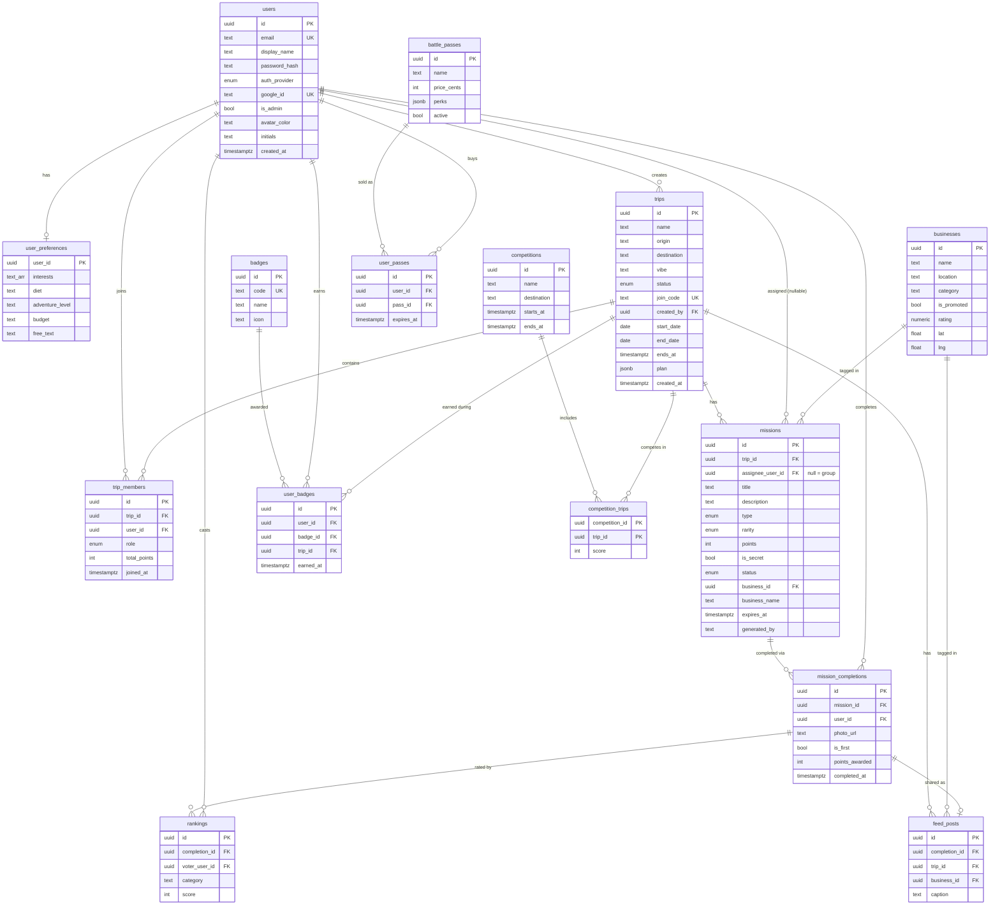

# SideQuest

Every journey generates a temporary multiplayer game. Players get AI-generated
missions along the route, complete them, earn points and badges, and rank each
other — the product exists entirely between **START → ARRIVED**.

BuildersTable Hackathon 2026 · Theme: Travel (the journey, not the destination)

## Repo layout

| Path | What |
|---|---|
| `backend/` | FastAPI API (missions, trips, plan) + LLM integration |
| `frontend/` | Next.js app (Paper Chaos design) |
| `design/` | Design system + assets |
| [`BACKEND.md`](BACKEND.md) | Backend architecture, contracts, decisions |
| [`DATABASE.md`](DATABASE.md) | DB schema + ER diagram (kept up to date per change) |
| [`INTEGRATION.md`](INTEGRATION.md) | How frontend + backend fit together |
| [`DEPLOY.md`](DEPLOY.md) | Run locally + free live-link hosting, step by step |
| `backend/mission_generator.md` | The rich mission-generation prompt |
| [`supabase/schema.sql`](supabase/schema.sql) | Runnable Postgres schema (paste into Supabase SQL Editor) |

## Database schema

Full details + SQL in [`DATABASE.md`](DATABASE.md); runnable file at
[`supabase/schema.sql`](supabase/schema.sql). Legend: 🟢 MVP · 🔵 later · 🟣 roadmap.



## Quickstart (local)

**Backend** (terminal 1):
```bash
cd backend
python -m venv .venv && source .venv/bin/activate
pip install -r requirements.txt
cp .env.example .env          # add GEMINI_API_KEY etc. (optional — runs on fallbacks)
uvicorn app.main:app --reload    # http://localhost:8000  (/docs, /health)
```

**Frontend** (terminal 2):
```bash
cd frontend
cp .env.local.example .env.local
npm install
npm run dev                      # http://localhost:3000 (or 3001 if 3000 is busy)
```

**Or everything in Docker:**
```bash
docker compose up --build        # frontend :3000, backend :8000
```

It runs with **zero keys** (in-memory store + fallback missions). Add
`GEMINI_API_KEY` for real place discovery + the rich mission plan. `/health` shows
what's active.

## Deploying a live link

See [`DEPLOY.md`](DEPLOY.md) — free options (Render recommended; Fly.io / Cloud
Run / Vercel) with step-by-step guides and secret-safety notes.

## Demo prep

Seed a realistic, populated demo (trip + crew + completed missions with photos +
points + badges) so the boards look alive on stage:
```bash
cd backend && source .venv/bin/activate
python scripts/seed_demo.py     # backend must be running; uses ADMIN_* + Supabase
```
Then sign in as the admin to see the "Garden Route Crew" trip fully populated.

**Missions** come from Claude if `ANTHROPIC_API_KEY` is set, else **Gemini**, else a
destination-aware fallback deck (so a live demo always has legitimate-looking
missions even if the LLM is rate-limited).

## Notes

- **Persistence:** **Supabase** when `SUPABASE_URL` + service key are set (the
  backend auto-selects it; schema in `supabase/schema.sql`); falls back to an
  in-memory store otherwise. User mission photos use **Supabase Storage**.
- **Secrets:** backend-only, via env vars; never committed or baked into images.
  Admin override is seeded from `ADMIN_EMAIL`/`ADMIN_PASSWORD` into the DB.
